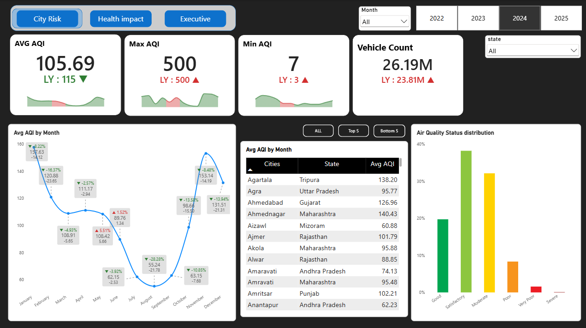
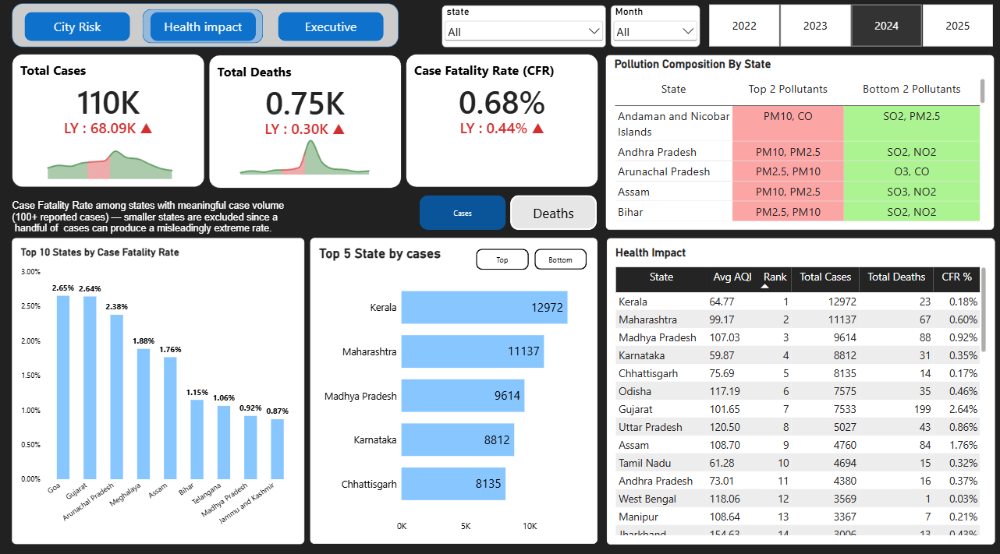
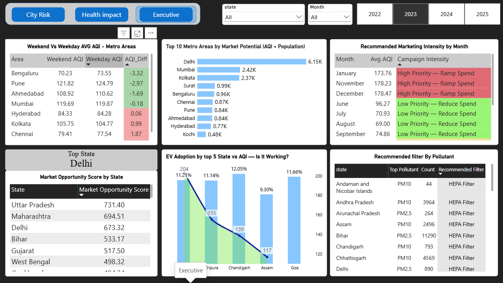

# AirPure Innovations — AQI Analytics & Product Market Fit

## 📌 Overview

AirPure Innovations is a startup built around India's air quality crisis, with several Indian cities ranking among the world's most polluted urban centers. Before committing to production and R&D, the company needed a clear, data-backed view of where air quality is worst, how it behaves over time, what health burden it carries, and whether current market trends (like EV adoption) are actually helping.

This repository documents that work: the data cleaning and modeling done in SQL, the interactive dashboard built in Power BI, and the supporting research pulled in from outside the core datasets.

**Context:** built as part of a guided resume project challenge (problem statement and raw datasets were provided). The data cleaning approach, coverage thresholds, DAX logic, and analytical choices documented below are my own work on top of that brief.

---

## 📦 Deliverables

| Dashboard |
|---|
| **[Live Power BI Dashboard](https://app.powerbi.com/view?r=eyJrIjoiY2NhOWEzYTUtOWY0Yy00NzFmLWE3YmUtZjJiMGE4MjkyNDcxIiwidCI6ImM2ZTU0OWIzLTVmNDUtNDAzMi1hYWU5LWQ0MjQ0ZGM1YjJjNCJ9)** |

---

## 🔑 Key Findings

*(Figures below are read directly off the dashboard at its 2024 view unless noted — re-check against the live link if you adjust the filters.)*

- **Most polluted areas, after applying a minimum-coverage threshold** (a city isn't ranked unless it has enough reporting days to be trustworthy) — the worst-ranked areas include Byrnihat (Assam), Delhi, Hajipur (Bihar), Gurugram, and Ghaziabad.
- **PM10 is the dominant pollutant nationally**, showing up as the top pollutant in effectively every state reviewed (e.g. Andhra Pradesh, Assam, Bihar, Chandigarh), with PM2.5 consistently the second most common.
- **Air quality is sharply seasonal** — average AQI climbs to roughly 155–180 in November and December and drops to its lowest, around 55–65, in July and August. January through December fluctuates by close to 3x across the year.
- **Weekend vs. weekday AQI shows no consistent direction** across metro areas — some cities improve on weekends (Bengaluru −3.3, Pune −3.0, Ahmedabad −1.7), others get slightly worse (Chennai +1.9, Kolkata +1.0), and a few barely move (Mumbai, Hyderabad). There's no single "weekends are cleaner" pattern nationally.
- **Disease case fatality rate (CFR) is highest in Goa (2.65%) and Gujarat (2.64%)** among states with a meaningful case volume (states with very few reported cases are excluded, since a handful of cases can produce a misleadingly extreme rate).
- **Kerala has the highest total reported case volume** (~13K), followed by Maharashtra (~11K) and Madhya Pradesh (~9.6K) — though case volume and fatality rate don't move together, which is worth noting on its own.
- **EV adoption shows no clear relationship with AQI** even among the states with the highest adoption rates — adoption is still in the low single digits everywhere, so it's too early for it to be moving the needle on air quality.
- **Delhi, Uttar Pradesh, and Maharashtra rank highest on a population-weighted market opportunity score**, making them the clearest early targets for a product launch; Delhi alone also tops the metro-level market-potential ranking (AQI × population) by a wide margin.

---

## 🖥️ Dashboard Preview

**City Risk view** — severity KPIs, seasonal trend with YoY callouts, ranked city table, air quality status distribution


**Health Impact view** — case/death/CFR KPIs, pollutant composition by state, CFR ranking with a minimum-case filter applied


**Executive / Market view** — weekday vs. weekend comparison, metro market potential, seasonal marketing-intensity recommendation, EV adoption vs. AQI, and the market opportunity score


---

## 🗂️ Repository Structure

```
├── Primary Analysis/      → Power BI visuals and outputs for the core AQI, disease, and vehicle analysis
├── Secondary Analysis/    → Externally researched findings (health impact, market, policy, awareness), with sources
├── Project Inputs/        → Problem statement, dataset metadata, and supporting source documents
├── screenshots/           → Dashboard page images used in this README
└── README.md
```

---

## 📊 Data Sources & Methodology

- **Source data:** day-wise state/city AQI readings, state-and-district-level disease outbreak reports, state-and-month vehicle registration records by fuel type, and state population projections — provided as part of the project brief, originally sourced from the Dataful platform.
- **Cleaning, done in SQL:** duplicate removal, correction of truncated/inconsistent state names, handling of missing values (set to null rather than dropped where the rest of the row was still usable), and exclusion of rows with no usable state or date.
- **Minimum-coverage threshold:** a city is only included in severity rankings if it has enough reporting days in the selected window — this prevents a city with a handful of readings from outranking one with hundreds.
- **Minimum-case threshold for CFR:** states with very few total reported cases are excluded from the case-fatality-rate ranking, since a small number of deaths out of a small number of cases produces an extreme, unreliable percentage.
- **Market Opportunity Score:** a transparent, equally-weighted composite — 50% normalized average AQI severity + 50% normalized population, both scaled 0–1 across states before combining. This is a stated analytical assumption for prioritization purposes, not a measured quantity, and the weighting is disclosed rather than hidden.
- **Metro population figures** used in the market-potential chart came from external city-population data (not part of the original datasets), since the provided population data is state-level only — cited in the Secondary Analysis folder.

---

## 🛠️ Tools Used

- **SQL** — all data cleaning, validation, and the core calculations; the source of truth for every number on the dashboard
- **Power BI** — data modeling, DAX measures, and the interactive dashboard
- **Excel** — small supporting calculations and sanity checks
- **External research** — used only where the internal datasets couldn't answer a question (health-impact literature, competitor pricing, AQI awareness surveys, policy coverage), and always cited in Secondary Analysis

---

## 🎯 Why This Approach

The dashboard isn't just built to look complete — every number on it is checkable. Thresholds like minimum data coverage and minimum case volume are deliberate, documented choices; exclusions and known gaps (for example, a handful of states with no AQI monitoring coverage at all) are disclosed rather than smoothed over; and anything that couldn't be answered from the internal data was either clearly sourced externally or explicitly marked as unanswered instead of estimated.
